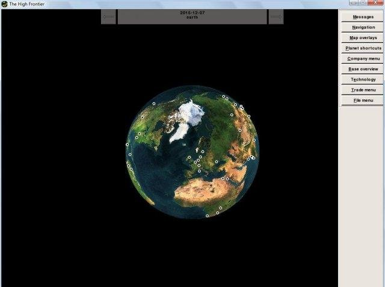
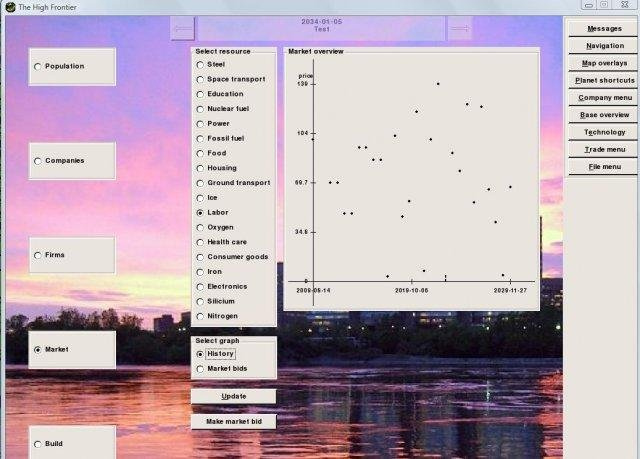
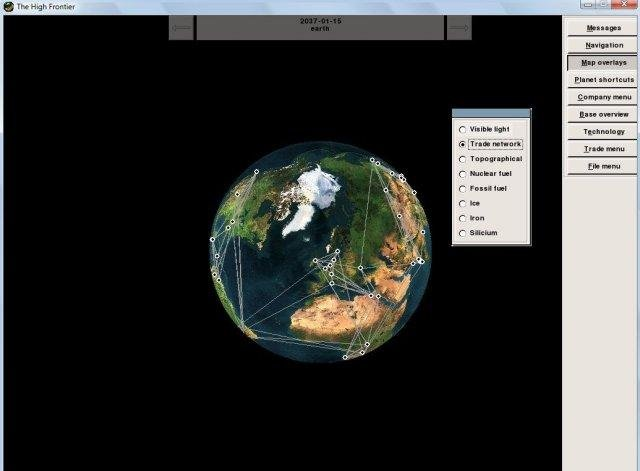

## Special note on this fork

This is an attempt to port the original High Frontier game to python 3.10.
Note that if the game seems to work, not everything has been tested and many
errors might be thrown when running the game.

# High Frontier

The goal of High Frontier is a civilization-like game, which uses more realistic modelling of economy, climate, research and migration. Uniquely this game starts today - the initiation date of a game is todays date and the existing world is the world as we know it today, complete with cities and countries and people. The aim from there - that is whatever the player thinks the aim is for the world. Developing of the underdeveloping world, action against climate changes, expansion into the rest of the solar system, or just racking in a lot of money.

The game is currently somewhat playable. Working features include:
- Google-earth-like map view of the Earth and all other bodies of the solar system. Complete solar system model with accurate orbital data.
- Underlying economical model based on agents (countries or companies) buying and selling goods thereby setting price. Genetic/evolutionary algorithm copies variations of best agents thus continuously perfecting the AI decisions
- Infinitly expandable research tree based on automatic technology-name generation by random selction from lists of tech-buzz-words (same way as it happens in the real world)
- climate model, including the feature of changing sea levels based on topographical maps of the planet in question. Nice for terraforming a northern ocean on Mars. Less nice for rampant greenhouse-effects on earth (allows checking if your country should worry more or less about carbon emission in real life as well)


## GAME BACKGROUND

The game starts at current date and the objective is whatever you want the future to be like. The game is designed to be a fairly accurate simulation of the world and its economical and natural environment.

All economical transactions centers around a base and its market. On Earth a base is equal to a city. In each market a number of important resources are traded using a system much like what is known from stock markets. Bids for selling and buying are setup specifying a quantity and a desired price. If any sellers will match the price of a buy-offer a transaction is made, and vice versa for buy-offers. The result is a price setting of goods according to supply and demand. Each agent on the market corresponds to a country or a multinational company. The two are treated more or less the same, and the human player takes the role of one such company. Each company has a set of variables defining how it prices and bids for goods, how it decides to start up firms and how it performs research. If a company goes bankrupt a new company is spawned bearing close resemblance to one of the leading companies. As such the market evolves towards optimal pricing and transaction of goods as needed. Input of resources start with primary industry firms: mines and farms. The efficiency of these depends technology level and the availabilty of resource around the base in question. Resource availability can be seen in the map-overlay mode in global view. Main output of resources will go primarily towards building new bases and firms, research, transport of goods and - most importantly - demands of the base. Each base has a set of demands: food, housing, education, health care and consumer goods. The relative demands of each is set according to a Maslow pyramid of demands. If no food is supplied, demand for food over-shadows everything else. Moving up from satisfying basic needs, education and consumer goods become more important. A viable strategy for making money is therefore to focus on satisfying the demands of other players bases. A company can also owns bases in which case it controls the selling of labor force. Another strategy is to buy or build bases and use them as economical center for generating further growth.

All natural environment actions center around the planet, its atmospheric components, its orbital configuration and the its interactions with the economical environment, primarily emitters of gases and other byproducts. The simulation calculates atmospheric variables such as temperature, pressure and oxygen content based gravity and current levels of atmospheric gas species. Temperature will be affected primarily by the presence of greenhouse gases, while viability of the atmosphere (and hence farming efficiency and housing construction cost) will be determined by partial pressure and oxygen content. If temperature rises, polar ice reservoirs convert to liquid water and cover increasing parts of the surface of the planet. Useful for terraforming new planets, but problematic for an already settled and viable Earth. A strategy for creating new living space is therefore to create many firms that has greeenhouse gases as byproducts on Mars. A strategy for stopping run-away greenhouse effects on Earth is to stop fossil fuel utilization. Of course in order to keep the demand from bases supplied, another source of energy has to be used. If this is increased research in renewable energy, a general shift to nuclear power or the moving away from the Earth surface will be decided by the economical actions of the companies and countries.

The technological research model is based on an infinitely expanding tree of progressively more refined technology in each of a number of different broad areas. At game start only the basic technologies are available to each company but research through the establishment of research facilities or buying of technologies in the trade menu enables the building of more advanced firm types that will make more efficient use of input resources.


## GAME CONTROL

Arrow keys control the view-point of planets and technology tree
Page-up and page-down functions as zoom keys when viewing the solar system, a moon or planet, or the technology tree. If a base is selected the final zoom-in step will change to viewing that base specifically.
Bases and planets can be selected by left-clicking on them. Right-clicking performs an instant zoom.
In general, menu items are selected with the left-mouse-button and executed with the right-mouse-button.

The first step a player will take is usually to start building firms. This is done when zoomed in on a base, under the build menu item. Selecting this will show a list of technologies and standard buildings available to the player. Right-clicking on any will start the building. In most cases the first question is the size of the firm to be built. This determines the output and input requirements in each game-iteration (30 days) and any size will do.

In the case of selecting to build a new base the player will be prompted for a location. This can be anywhere on any planet or in orbit around this planet. A left-click in space or on planetary-surface after selecting to build base will select placement in that location. The price of the base is then calculated based on its size and the distance to the building base. Orbital lifts from heavy-gravity surfaces are priced very expensively, and the price rises exponentially. So extraplanetary missions are best started from orbital locations. Once materials for the construction has been obtained in the building base, it will be created at the location specified.

In the case of selecting to build a merchant, the player will be prompted for destination for the merchant. All merchant firms trade in one type of resource between two fixed bases. The base in which it is built is the origin. Transport will happen automatically as soon as transport and the transported resource is available in the base of origin.

Once a firm is build it will need to buy and sell resources. The player places bids when viewing the market from the page of that firm. Clicking the "place bid" button and then the market or history graph will create a bid at the price and quantity at which the market or history graph is clicked. When multiple firms have been built the player will likely want to switch on automatic demand and supply bidding mode from the automation settings in the settings menu.

If a research firm is operating the player will need to select a research path. The future goals of research can not be exactly defined. Instead the player chooses to start from an already known technology. Chances are that the found technology will be in the same field or a closely related field, but this is not known before the research has started. Left-click selects a technology. Right-click provides information about that technology.


## Installation

These pre-[compiled python-binaries](https://sourceforge.net/projects/highfrontier/files/?source=navbar) will work on a 2009-machine, but on most modern machines they will only show the intro and not much further than that. There's also an ubuntu debian image there, with the same caveat.

Setting up from source is possible however.

### From source

* [Python 3.10](https://www.python.org/downloads/)
* [Pygame](http://www.pygame.org/)
* Python Image Module: [PIL](https://pillow.readthedocs.io)

You can all install through pip

```
pip install -r requirements.txt
```

Then run by starting the intro.py file.

In either case it can then be run by typing:
```
python intro.py
```


## Screenshots


View of the main starting planet


City view, showing the local labor market price development


Orbital view of different planets, zoomable and with accurate orbital mechanics



These go on land, but space-based connections are also implemented